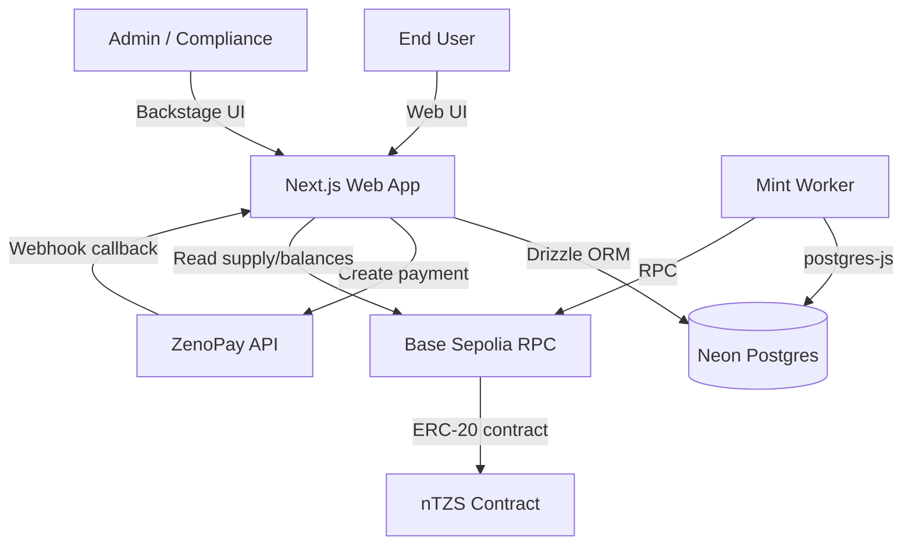
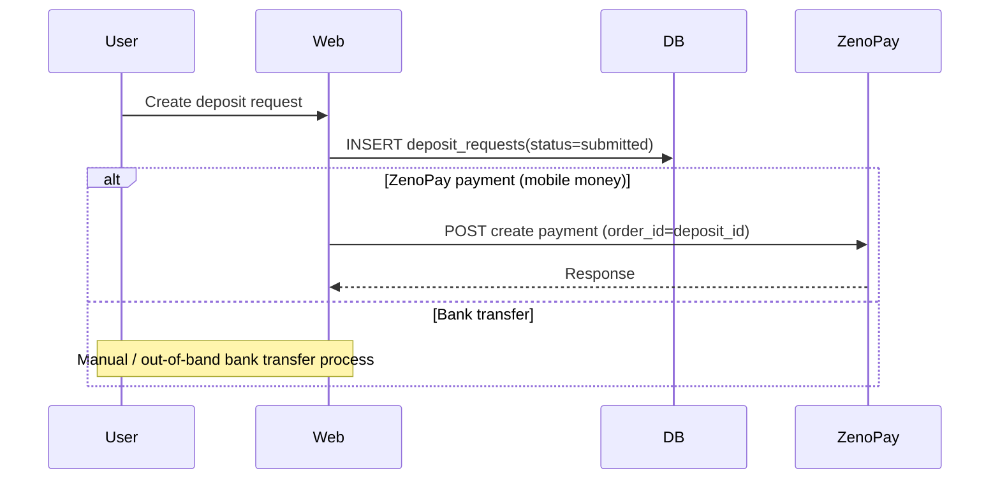
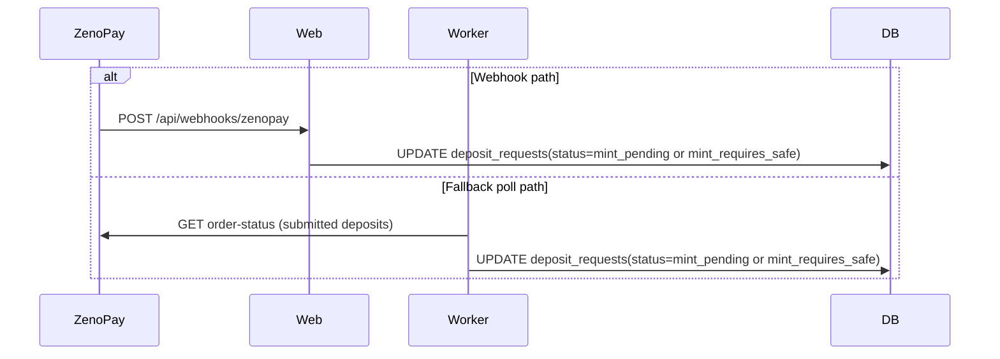
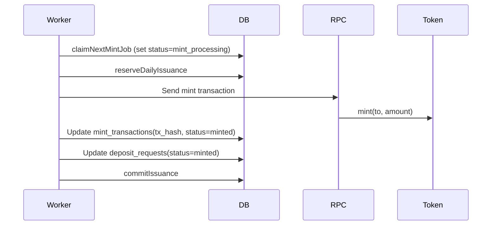

# Architecture

## Overview

nTZS is a fiat-backed stablecoin-style system where approved Tanzanian Shilling deposits result in on-chain issuance of an ERC-20 token (`nTZS`).

The system consists of:

- A Next.js web application (`apps/web`) for users and administrators
- A background minting worker (`apps/worker`) that mints tokens and updates the database
- A PostgreSQL database (Neon) that stores users, KYC, deposits, approvals, mint transactions, and audit logs
- A Hardhat-based smart contract project (`packages/contracts`) containing the `NTZS` token contract

## Component Diagram

## Responsibilities

### Web App (`apps/web`)

- User onboarding
- KYC submission and status display
- Wallet registration and verification
- Deposit request creation
- Admin Backstage workflow:
  - View deposits
  - Review and approvals (bank/platform roles)
  - Monitor minting queue
  - Safe approval flow for large mints
  - Reconciliation UI for on-chain vs DB totals

### Worker (`apps/worker`)

- Poll `deposit_requests` for `mint_pending` jobs
- Claim one job atomically (`for update skip locked`)
- Enforce daily issuance caps via `daily_issuance`
- Execute `mint(to, amount)` on the token contract
- Persist and update:
  - `mint_transactions`
  - `deposit_requests` status transitions
  - `audit_logs`
- Poll ZenoPay as a fallback to advance deposits from `submitted` to `mint_pending` if webhook delivery fails

### Database (Neon Postgres)

- System of record for off-chain processes
- Provides auditability for all state transitions
- Enables reconciliation of on-chain supply and off-chain totals

### Smart Contract (`packages/contracts`)

- ERC-20 token with:
  - Role-based mint and burn
  - Pausable transfers
  - Per-address freeze
  - Blacklist + wipe (burn blacklisted balances)

## Key Data Flows

### Deposit creation (web)

### Payment confirmation (webhook + fallback poll)

### Minting (worker)

## Reconciliation Model

On-chain supply is the source of truth.

The Backstage minting dashboard computes:

- `DB Minted`: sum of `deposit_requests.amount_tzs` for deposits with status `minted`
- `Reconciled`: sum of `reconciliation_entries.amount_tzs`
- `Total Tracked`: `DB Minted + Reconciled`
- `Discrepancy`: `On-Chain totalSupply - Total Tracked`

This allows auditors to see discrepancies and the explanation for each one.

## Deployment Notes

- Web app typically runs on a managed platform (e.g. Vercel).
- Worker runs as a long-lived process (container/VM) or a managed job runner.
- Postgres runs on Neon.
- Base Sepolia is used for the current testnet environment.
