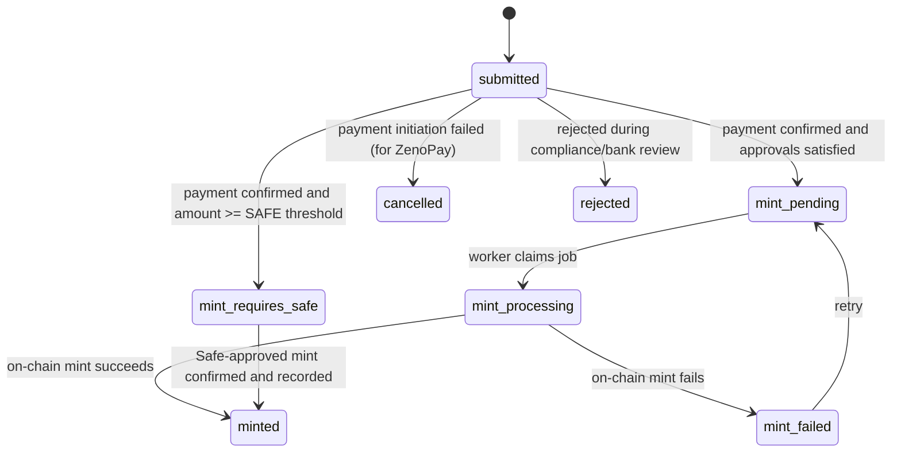

# Deposit to Mint Lifecycle

This document describes the end-to-end lifecycle for issuance of nTZS.

## State Machine

Primary entity: `deposit_requests`.

## How deposits are created

### User flow (ZenoPay / mobile money)

File: `apps/web/src/app/app/user/deposits/new/actions.ts`

- User submits amount and phone.
- App inserts a `deposit_requests` row with:
  - `status = submitted`
  - `payment_provider = zenopay`
  - `buyer_phone` formatted to Tanzanian format
- App calls ZenoPay `create payment` with:
  - `order_id = deposit_requests.id`
  - `webhook_url = {NEXT_PUBLIC_APP_URL}/api/webhooks/zenopay`

### User flow (bank transfer)

- Deposit is created as `submitted` with `payment_provider = bank_transfer`.
- Fiat confirmation is handled through the admin/compliance workflow (out-of-band transfer verification).

## How a deposit advances from `submitted`

There are two mechanisms:

### A) Webhook (preferred)

Endpoint: `POST /api/webhooks/zenopay`

- ZenoPay sends webhook payload containing `order_id` and `payment_status`.
- When `payment_status == COMPLETED`, the web app updates the deposit:
  - `status = mint_pending` if amount < threshold
  - `status = mint_requires_safe` if amount >= threshold
  - Stores PSP reference fields (`pspReference`, `pspChannel`)

### B) Polling (fallback)

- Worker polls ZenoPay order status for deposits still in `submitted`.
- If ZenoPay indicates completion, the worker updates the deposit to `mint_pending` or `mint_requires_safe`.

### Manual fallback (admin)

- Backstage includes a manual transaction-id input for cases where the PSP order-status endpoint is unreliable.
- This allows an admin to advance a deposit only when they have verified payment in the PSP dashboard.

## Minting thresholds and Safe flow

- `SAFE_MINT_THRESHOLD_TZS = 9000`
- For deposits at or above the threshold:
  - Deposit becomes `mint_requires_safe` and is expected to be minted via a multisig Safe.
  - After Safe execution, admin records the tx hash and the system verifies the mint via transfer logs and updates the DB.

## Minting worker process

File: `apps/worker/src/index.ts`

Key properties:

- Claims one mint job at a time using an atomic update query with `for update skip locked`.
- Uses `daily_issuance` to enforce a daily issuance cap.
- Uses `ethers` to submit a mint transaction.
- Records:
  - `mint_transactions.tx_hash`
  - `mint_transactions.status`
  - `deposit_requests.status`
  - `audit_logs`

## Idempotency and safety properties

- Deposit IDs are UUIDs; ZenoPay uses them as `order_id`.
- Minting job claim is atomic and uses row locking to prevent double-processing.
- `mint_transactions` uses `deposit_request_id` as a conflict target so repeated processing updates the same row.
- Safe flow confirmation verifies the actual on-chain mint via the `Transfer` event.

## Failure modes

- Webhook not received:
  - Worker polling provides a fallback.
- PSP order-status returns empty/invalid response:
  - Admin can manually input transaction ID after verification.
- RPC or mint failure:
  - Deposit transitions to `mint_failed` and can be retried.
- Daily issuance cap exceeded:
  - Job is returned to `mint_pending` and `mint_transactions` is marked as cap exceeded.
